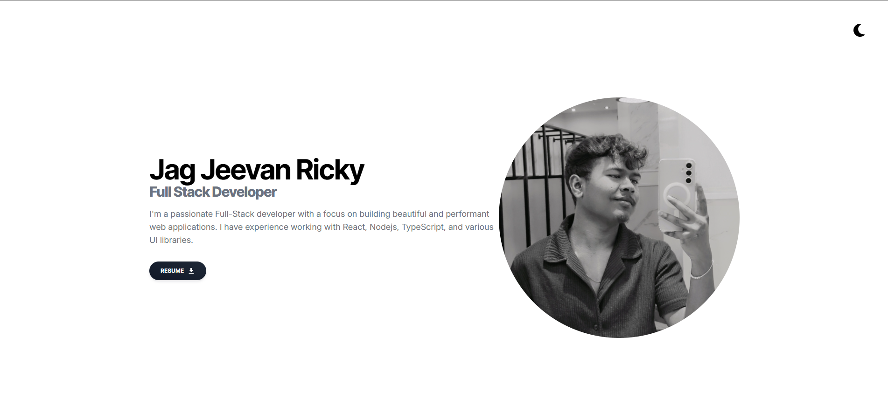

# 🚀 Minimal Portfolio

A modern, responsive portfolio website built with **React** and **Tailwind CSS**.

---



## ✨ Features

- **Responsive Design** — Looks great on all devices
- **Dark Mode** — Toggle between light and dark themes
- **Modern UI** — Clean, minimal, and elegant interface
- **Easy Customization** — Update content and styles easily
- **Component-Based** — Built with reusable React components
- **Animated Interactions** — Smooth transitions with Framer Motion
- **Contact Form** — Integrated with [Web3Forms](https://web3forms.com/) for easy messaging

---

## 🛠️ Tech Stack

- [React](https://reactjs.org/)
- [Tailwind CSS](https://tailwindcss.com/)
- [Framer Motion](https://www.framer.com/motion/)
- [React Icons](https://react-icons.github.io/react-icons/)
- [Web3Forms](https://web3forms.com/) (Contact Form)
- [Vite](https://vitejs.dev/)

---

## 📦 Installation

1. **Clone the repository**
   ```bash
   git clone https://github.com/yourusername/portfolio_02.git
   cd portfolio_02
   ```

2. **Install dependencies**
   ```bash
   npm install
   ```

3. **Start the development server**
   ```bash
   npm run dev
   ```

4. **Open your browser and visit**
   ```
   http://localhost:5173
   ```
---

## 📁 Project Structure

```
portfolio_02/
├── public/
├── src/
│   ├── Components/
│   │   ├── 0_Assets/
│   │   ├── 1_Home/
│   │   ├── 2_About/
│   │   ├── 3_Skills/
│   │   ├── 4_Projects/
│   │   ├── 5_Contacts/
│   │   ├── 6_Footer/
│   │   ├── 7_Timeline/
│   │   ├── 8_FAQ/
│   │   └── 9_Hobbies/
│   ├── App.jsx
│   ├── App.css
│   ├── index.css
│   └── main.jsx
├── package.json
├── tailwind.config.js
└── vite.config.js
```
- **Components/**: All React components, organized by section.
- **0_Assets/**: Images and static assets.
- **App.jsx**: Main application component.
- **main.jsx**: Entry point for React.
- **tailwind.config.js**: Tailwind CSS configuration.

---

## 🖌️ Customization

- **Update Content:**  
  Edit your personal details, projects, and sections in the respective files inside `src/Components/`.
- **Change Images:**  
  Replace or add images in `src/Components/0_Assets/` to personalize visuals.
- **Modify Styles:**  
  Adjust Tailwind CSS classes in component files or update global styles in `src/App.css` and `src/index.css`.
- **Add/Remove Sections:**  
  Easily add new sections or remove existing ones by editing or creating components in the `Components` folder.

---

## 🌐 Live Demo

> [🔗 View the Live Portfolio](https://g-1portfolio.vercel.app/)

---

## 📄 License

This project is licensed under the [MIT License](LICENSE).  
Feel free to use, modify, and share!

---
<p align="center">Made with ❤️ by Jag Jeevan Ricky</p>